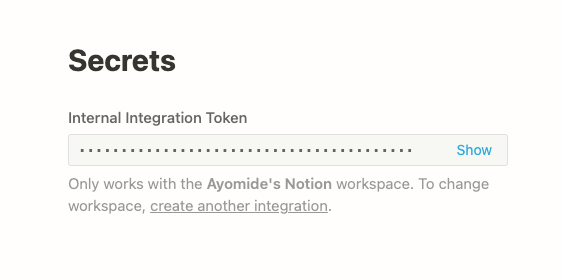
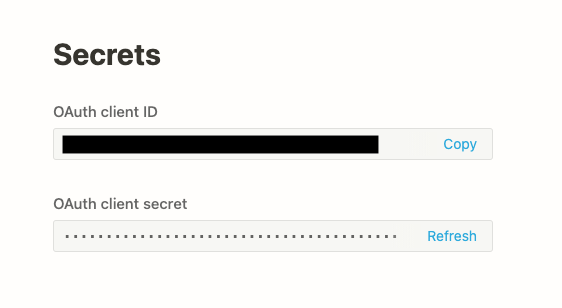

# go-notion

go-notion is a minimal Go client library for [Notion's v1 API](https://developers.notion.com/). Check the [usage] or
examples to see how to access Notion's v1 API.

***NB**: Notion's v1 API is still in beta; this integration may change as they update it.*

## Table of Contents

* [Installation](#installation)
* [Authentication](#authentication)
    * [Internal Integration](#internal-integration)
    * [Public Integration](#public-integration)
* [Usage](#usage)
    * [Databases](#databases)
    * [Pages](#pages)
    * [Blocks](#blocks)
    * [Users](#users)
    * [Search](#search)
* [Contributing](#contributing)
* [License](#license)

## Installation

```
go get github.com/oyekanmiayo/go-notion/notion/version1
```

## Authentication

HTTP requests to Notion's API must contain a bearer token in the `Authorization` header to be successful. Currently,
Notion allows two types of integrations: Internal and Public. Getting the bearer token is different for each case.

### Internal Integration

When you create an internal integration on Notion's developer portal, you are given something called an "Internal
Integration Token" - this is the bearer token. All you need to do is simply copy it out and store it as an environment
variable (preferred) or use it directly in your code.



NB: Internal Integration Token, Bearer Token and Access Token mean the same things here.

```go
import (
	notion "github.com/oyekanmiayo/go-notion/notion/version1"
	"net/http"
	"os"
) 

func main() {
	accessToken := os.Getenv("NOTION_BEARER_TOKEN")
	
	// Notion Client
	client := notion.NewClient(http.DefaultClient, accessToken)
}
```

### Public Integration

This integration receives bearer tokens each time a user completes the [OAuth flow](https://developers.notion.com/docs/authorization#authorizing-public-integrations).
Basically, this is in 3 steps:
1. **The client** requests authorization from a user
2. **Notion** calls a callback url (a.k.a `redirect_uri`) with `state` and `code` as query params
3. **The client** exchanges the code for a token

```go
import (
	"flag"
	"fmt"
	"golang.org/x/oauth2"
	"log"
	"os"
	"net/http"
)

func main() {

	flags := flag.NewFlagSet("notion-example", flag.ExitOnError)
	clientID := flags.String("client-id", "", "Client ID")
	redirectURL := flags.String("url", "", "Redirect url")
	err := flags.Parse(os.Args[1:])
	if err != nil {
		log.Fatalf("error: %v", err)
	}

	c := oauth2.Config{
		ClientID:     *clientID,
		ClientSecret: "",
		Endpoint: oauth2.Endpoint{
			AuthURL:  "https://api.notion.com/v1/oauth/authorize",
			TokenURL: "https://api.notion.com/v1/oauth/token",
		},
		RedirectURL: *redirectURL,
	}

	// Generate the authorization url
	authURL := c.AuthCodeURL("")
	fmt.Println(authURL) 
	
	// The authorization url should be sent back to the client as a redirect
	// The user will see an option to give the integration access to their workspace
	// If the user approves the request, notion will call the call the callback url (a.k.a `redirect_uri`) with `state` and `code` as query params

	// Use the code here to get an access token that can now be used with go-notion's client
    resp, _ := notion.AccessToken(&c, code)
    fmt.Println(resp)

    client := notion.NewClient(http.DefaultClient, resp.AcessToken)
}
```

The `clientID` and `clientSecret` in the snippet above can be found on the developer portal:



## Usage

### Databases

Read more about the Database endpoints [here](https://developers.notion.com/reference/database).

#### Retrieve a database

This retrieves a Notion database based on a specified ID. Read more [here](https://developers.notion.com/reference/get-database).

```go
client := notion.NewClient(http.DefaultClient, *accessToken)

// Retrieve DB
db, _, err := client.Databases.RetrieveDatabase(databaseID)
if err != nil {
    fmt.Printf("Err %v\n", err)
}
```

See full code example [here](examples/version1/retrieve-database-example.go).

#### Query a database

This gets a list of [Pages](https://developers.notion.com/reference/page) contained in a database, filtered and ordered according to the filter conditions and sort
criteria provided in the request. Filters can single filters or compound filters. Read more [here](https://developers.notion.com/reference/post-database-query).

```go
client := notion.NewClient(http.DefaultClient, *accessToken)

// Query DB with SingleFilter
params := &notion.QueryDatabaseBodyParams{
    Filter: &notion.SingleFilter{
        Property: "Tags",
        MultiSelect: &notion.MultiSelectCondition{
            Contains: "Tag1",
        },
    },
}
resp, _, err := client.Databases.QueryDatabase(*databaseID, params)
if err != nil {
    fmt.Printf("Err %v\n", err)
}
```

See full code example [here](examples/version1/query-database-example.go) - it also contains a compound filter example :)

#### List databases

More than one database can be shared with a Notion integration. This endpoint lists all the databases shared with an
authenticated integration. Read more [here](https://developers.notion.com/reference/get-databases).

```go
client := notion.NewClient(http.DefaultClient, *accessToken)

// List all DBs in a workspace
params := &notion.ListDatabasesQueryParams{
    PageSize: 20,
}
resp, _, err := client.Databases.ListDatabases(params)
if err != nil {
    fmt.Printf("Err %v\n", err)
}
```

See full code example [here](examples/version1/list-databases-example.go).

### Pages

Read more about Page endpoints [here](https://developers.notion.com/reference/page).

#### Retrieve a page

This retrieves a Notion page based on a specified ID. Read more [here](https://developers.notion.com/reference/get-page).

```go
client := notion.NewClient(http.DefaultClient, *accessToken)

// Retrieve a page using its pageID
db, _, err := client.Pages.RetrievePage(*pageID)
if err != nil {
    fmt.Printf("Err %v\n", err)
}
```

See full code example [here](examples/version1/retrieve-page-example.go).

#### Create a page

Pages in Notion can be created within a database or within another page. This endpoint creates a page as a child of the
parent (database or page) specified. Read more [here](https://developers.notion.com/reference/post-page).

```go
client := notion.NewClient(http.DefaultClient, *accessToken)

params := &notion.CreatePageBodyParams{
    Parent: &notion.DatabaseParent{
        DatabaseID: *databaseID,
    },
    Properties: map[string]notion.PageProperty{
        "Name": {
            Title: []notion.RichText{
                {
                    Text: &notion.Text{
                        Content: "Creating Page Sample",
                    },
                },
            },
        },
        "Tags": {
            MultiSelect: []notion.MultiSelectPropertyOpts{
                {
                    Name: "Tag1",
                },
                {
                    Name: "Tag3",
                },
            },
        },
        "Recommended": {
            Checkbox: true,
        },
    },
}
resp, _, err := client.Pages.CreatePage(params)
if err != nil {
    fmt.Printf("Err %v\n", err)
}
```

The example above creates a page within a database. The body of the request is determined by the structure of the
database. See full code example [here](examples/version1/create-page-example.go) along with an example to create a page within another page.

#### Update page properties

Updates page property values for the specified page. Properties that are not set via the "properties" parameter will
remain unchanged. Read more [here](https://developers.notion.com/reference/patch-page).

```go
client := notion.NewClient(http.DefaultClient, *accessToken)

// Update the title of a page
params := &notion.UpdatePagePropertiesBodyParams{
    // first keys are the names or ids of the properties :)
    // id for title is "title"
    // See examples here: https://developers.notion.com/reference/page#page-property-value
    Properties: map[string]notion.PageProperty{
        "Name": {
            Title: []notion.RichText{
                {
                    Type: "text",
                    Text: &notion.Text{
                        Content: "Jamaican Cuisines III",
                    },
                },
            },
        },
        "Recommended": {
            Checkbox: true,
        },
    },
}
resp, _, err := client.Pages.UpdatePageProperties(*pageID, params)
if err != nil {
    fmt.Printf("Err %v\n", err)
}
```

See full code example [here](examples/version1/update-page-properties-example.go).

### Blocks

A block object represents content within Notion. Blocks can be text, lists, media, and more. A page is a type of block,
too! Read more about Block endpoints [here](https://developers.notion.com/reference/block).

#### Retrieve block children

Returns a paginated array of child block objects contained in the block using the ID specified. In order to receive a
complete representation of a block, you may need to recursively retrieve the block children of child blocks. Read more [here](https://developers.notion.com/reference/get-block-children).

```go
client := notion.NewClient(http.DefaultClient, *accessToken)

// Retrieve the block children for a block
params := &notion.RetrieveBlockChildrenParams{}
db, _, err := client.Blocks.RetrieveBlockChildren(*blockID, params)
if err != nil {
    fmt.Printf("Err %v\n", err)
}
```

See full code example [here](examples/version1/retrieve-block-children-example.go).

#### Append block children

Creates and appends new children blocks to the block using the ID specified. Returns the Block object which contains the
new children. Read more [here](https://developers.notion.com/reference/patch-block-children).

```go
client := notion.NewClient(http.DefaultClient, *accessToken)

// Append block children (Header Two & Paragraph) to a block
params := &notion.AppendBlockChildrenBodyParams{
    Children: []notion.Block{
        {
            Object: "block",
            Type:   "heading_2",
            HeadingTwo: &notion.HeadingTwo{
                Text: []notion.RichText{
                    {
                        Type: "text",
                        Text: &notion.Text{
                            Content: "Header Two Test",
                        },
                    },
                },
            },
        },
        {
            Object: "block",
            Type:   "paragraph",
            Paragraph: &notion.Paragraph{
                Text: []notion.RichText{
                    {
                        Type: "text",
                        Text: &notion.Text{
                            Content: "Paragraph Test",
                        },
                    },
                },
            },
        },
    },
}

db, _, err := client.Blocks.AppendBlockChildren(*blockID, params)
if err != nil {
    fmt.Printf("Err %v\n", err)
}
```

See full code example [here](examples/version1/append-block-children-example.go).

### Users

The User object represents a user in a Notion workspace. Users include guests, full workspace members, and bots. Read
more about User endpoints [here](https://developers.notion.com/reference/user).

### Retrieve a user

This retrieves a Notion user based on a specified ID. Read more [here](https://developers.notion.com/reference/get-user).

```go
client := notion.NewClient(http.DefaultClient, *accessToken)

// Retrieve a user by userID
db, _, err := client.Users.RetrieveUser(*userID)
if err != nil {
    fmt.Printf("Err %v\n", err)
}
```

See full code example [here](examples/version1/retrieve-user-example.go).

### List all users

Returns a paginated list of users for the workspace. Read more [here](https://developers.notion.com/reference/get-users).

```go
client := notion.NewClient(http.DefaultClient, *accessToken)

// List all users in workspace
params := &notion.ListUsersQueryParams{
    PageSize: 20,
}
db, _, err := client.Users.ListUsers(params)
if err != nil {
    fmt.Printf("Err %v\n", err)
}
```

See full code example [here](examples/version1/list-users-example.go).

### Search

Searches all pages and child pages that are shared with the integration and returns a list of databases and pages which
have titles that contain the `query` parameter. Other parameters like `sort` and `filter` also affect the output. Read
more about it [here](https://developers.notion.com/reference/post-search).

```go
client := notion.NewClient(http.DefaultClient, *accessToken)

// Search the workspace and return pages that have titles containing "Yurts"
// The result should be sorted in descending order of "last_edited_time"
params := &notion.SearchBodyParams{
    Query: "Yurts",
    Sort: &notion.Sort{
        Direction: "descending",
        Timestamp: "last_edited_time",
    },
    Filter: &notion.SearchFilter{
        Value:    "page",
        Property: "object",
    },
}
db, _, err := client.Search.Search(params)
if err != nil {
    fmt.Printf("Err %v\n", err)
}
```

See full code example [here](examples/version1/search-example.go).

### Contributing

* Code Contributions won't be accepted until Notion's v1 API is out of beta. This may change in the future, if needed
* Open an issue if you find a bug or missing integration

### License

[Apache 2.0 License](LICENSE)

### Authors
* [Ayomide Oyekanmi](https://twitter.com/_alternatewolf)