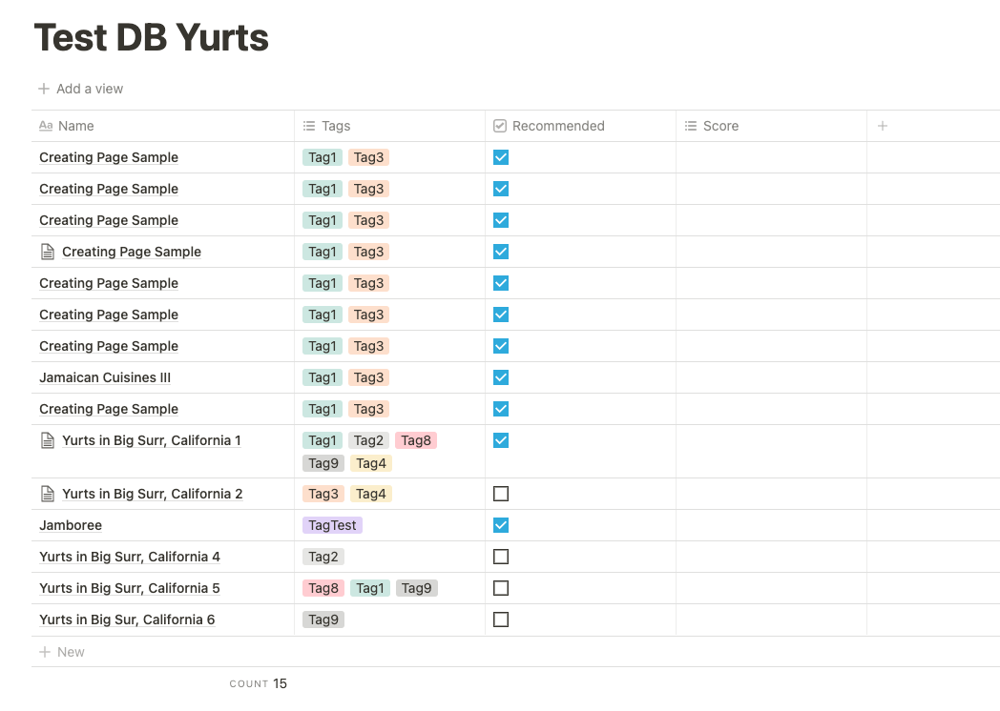
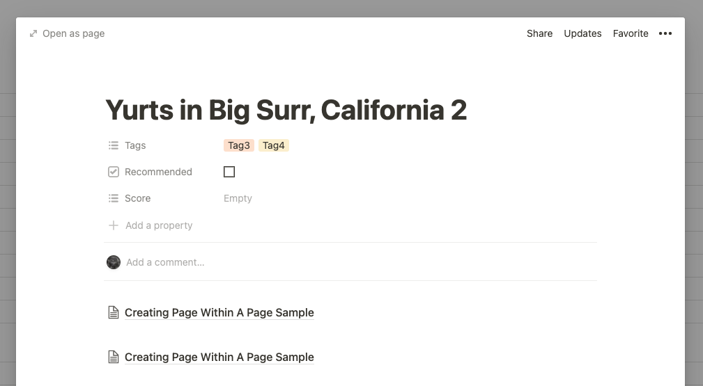
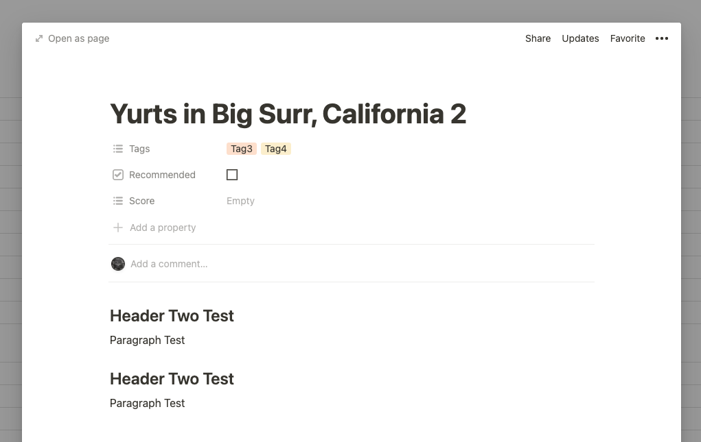

# go-notion examples

This README helps to provide useful information to help people understand the examples in this directory.

## Examples

* [Databases](#databases)
* [Pages](#pages)
* [Blocks](#blocks)
* [Users](#users)
* [Search](#search)

### Databases

The image below represents the structure of the database that was used in the examples.



#### Examples

* [Retrieve a database](retrieve-database-example.go)
* [Query a database](query-database-example.go)
* [List databases](list-databases-example.go)

### Pages

Pages can be added within databases or within other pages. If a page's parent is a database, it is added as an entry to
that database. The rows in the "Example DB" image above represents pages within the DB. If a page's parent is another
page, then it looks like the image below:



#### Examples

* [Retrieve a page](retrieve-page-example.go)
* [Create a page](create-page-example.go)
* [Update page properties](update-page-properties-example.go)

### Blocks

Read more about blocks [here](../../README.md#blocks). In the append-block example, I demo-ed adding a header and
paragraph to a page. It'll look like the image below.



#### Examples

* [Retrieve block children](retrieve-block-children-example.go)
* [Append block children](append-block-children-example.go)

### Users

#### Examples

* [Retrieve a user](retrieve-user-example.go)
* [List all users](list-users-example.go)

### Search

I couldn't figure out how to combine the two calls below into one call. Ideally, we should be able to make a call to the
Notion server that can contains an array of pages and databases. See the model below

```
type SearchResponse struct {
	Object     string           `json:"object,omitempty"`
	Results    []interface{}    `json:"results,omitempty"`
	NextCursor string           `json:"next_cursor,omitempty"`
	HasMore    bool             `json:"has_more,omitempty"`
}
```

The `Results` field cannot be `[]Page`, neither can it be `[]Database` because the results can be an array of both
models. So, for now, the calls are split (with its own model). I'll add the things I've tried later, but if you think of
something feel free to add as an issue to the repo :).

#### Examples

* [Search a page](search-example.go)
* [Search a database](search-example.go)